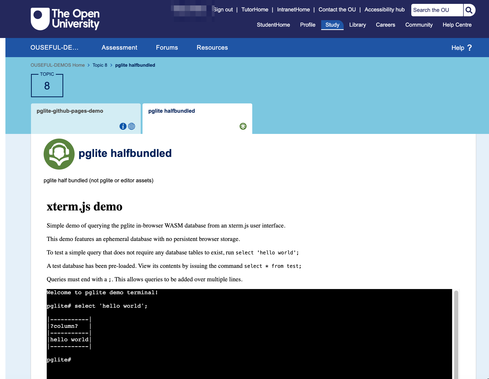

# Embedded WebAssembly (WASM) Applications

The JupyterLite environment is a complex application compiled to WebAssembly that can run as a self-contained application within the browser.

A growing number of applications are being compiled to Wasm versions that are capable of running independently inside the browser. This removes the need for any server requirement other than a simple HTTP server.

## PostgreSQL in the browser — `pglite`

The [`electric-sql/pglite`](https://github.com/electric-sql/pglite) application implements a single user PostgreSQL application that we can run embedded in the VLE.

For example, embedded in a URL resource page:

Or embedded in a "web page" (i.e. the sort of page that an OU-XML doument is rendered to?).

`pglite` can persist database updates in browser storage, allowing incremental activities to be developed over several pages.